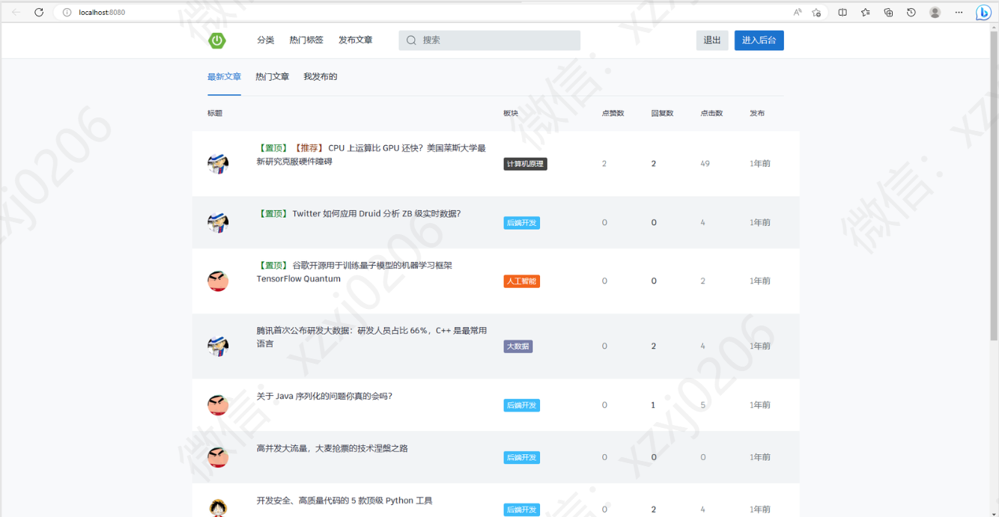
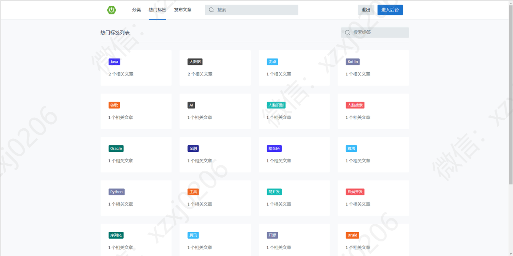
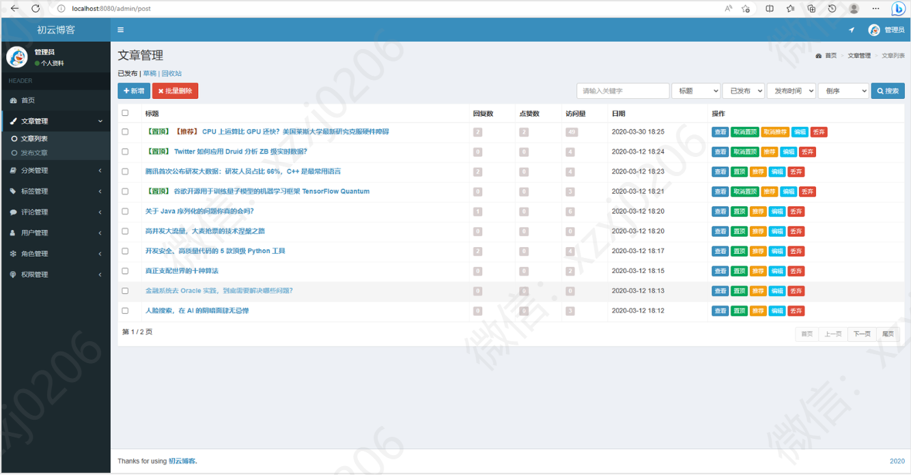
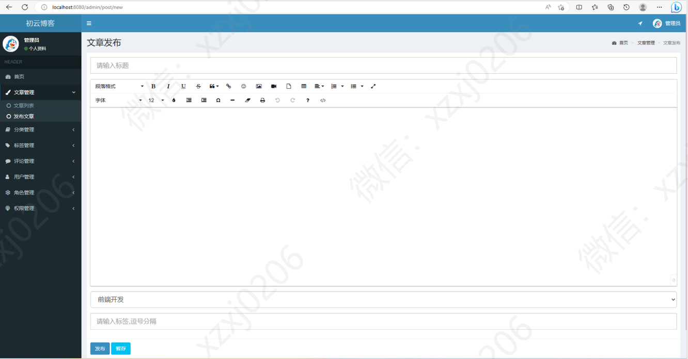
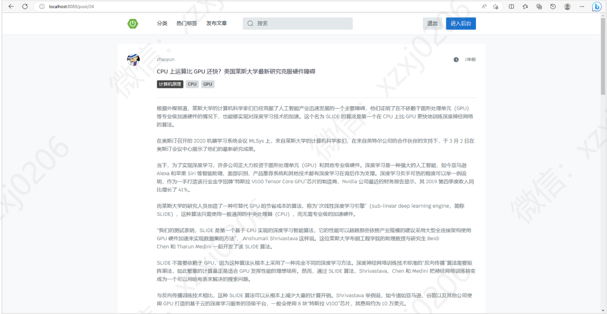
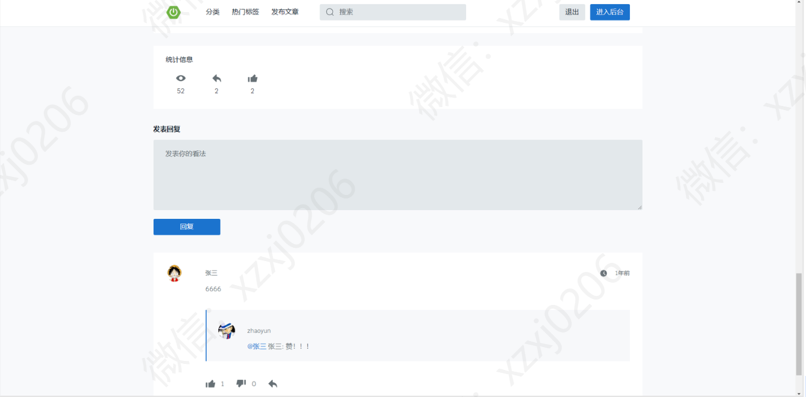

# 博客系统

### 9.9￥ 获取完整源码+sql，需要加Q：3577148218 ,备用Q: 3808981644
### 有问题，或者需要协助调试运行项目的也可联系
### 获取更多项目，关注公众号：编程项目集

### 一、项目介绍

语言：java

运行工具：idea或eclipse vscode 数据库：mysql

基于SpringBoot MyBatis JQuery html实现的博客网站

博客网站 

三个角色：游客 用户 管理员

游客可以浏览文章， 游客可以登录注册成用户，发布文章 管理自己的文章，评论和回复，点赞评论回复文章等 

管理员可以对整个系统用户管理，文章管理，分类管理，角色权限管理，评论管理等等

### 二、系统部分功能界面展示

### 9.9￥ 获取完整源码+sql，需要加Q：3577148218 ,备用Q: 3808981644
### 有问题，或者需要协助调试运行项目的也可联系

