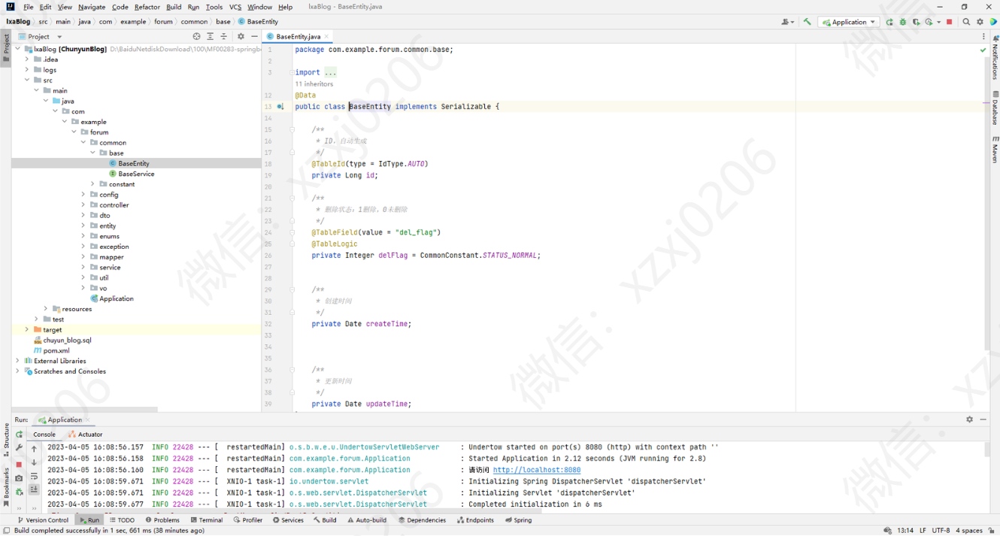
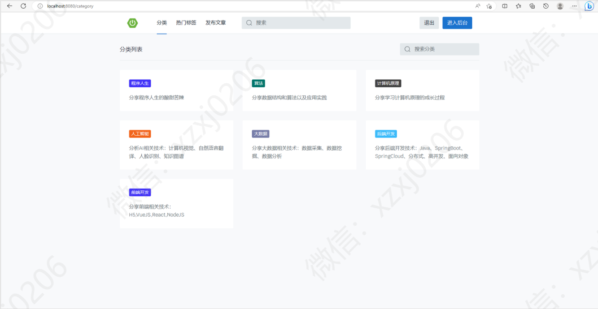
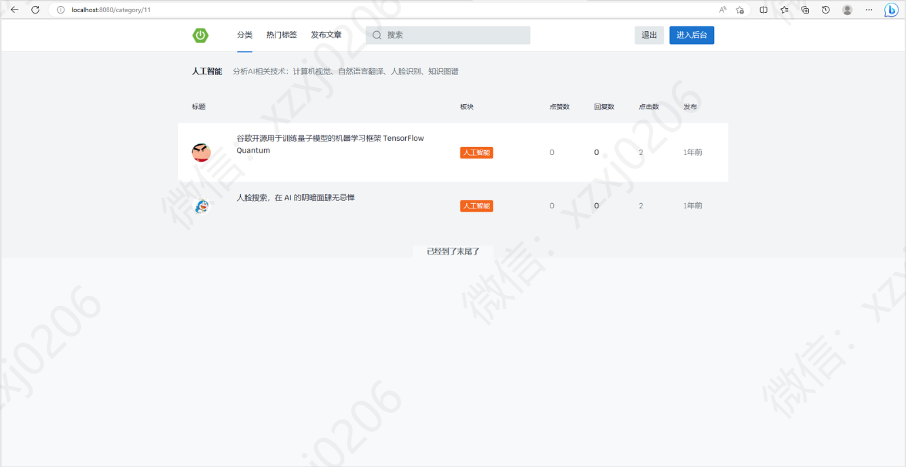
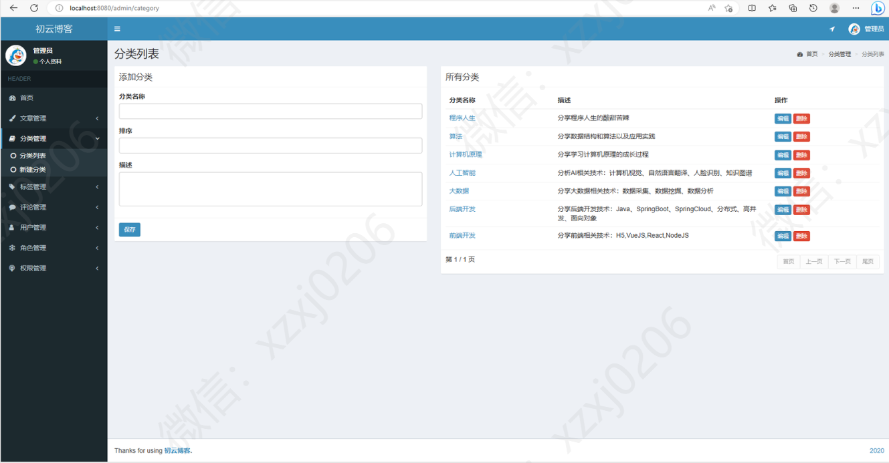
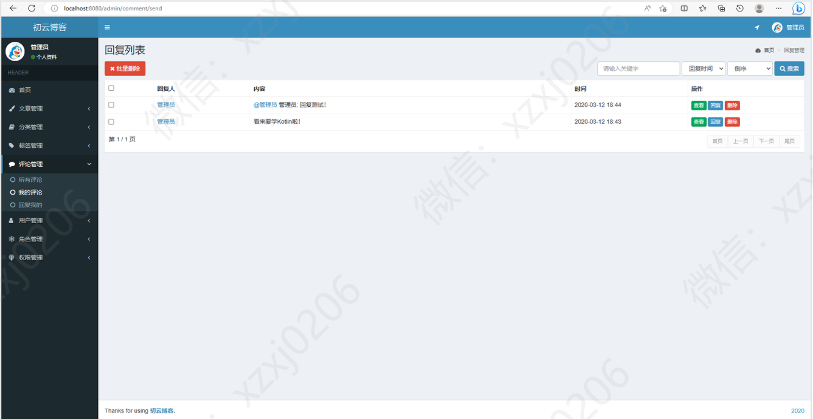

# 博客系统

#### 有问题，或者不会调试运行的同学, 可以添加微信：xzxj0206

## 一、项目介绍

基于SpringBoot Java MyBatis MySQL JQuery html实现的博客网站

博客网站 游客可以浏览文章， 游客可以登录注册成用户，发布文章 管理自己的文章，评论和回复，点赞评论回复文章等 管理员可以对整个系统用户管理，文章管理，分类管理，角色权限管理，评论管理等等

## 二、系统运行界面

## 三、系统部分功能界面展示

